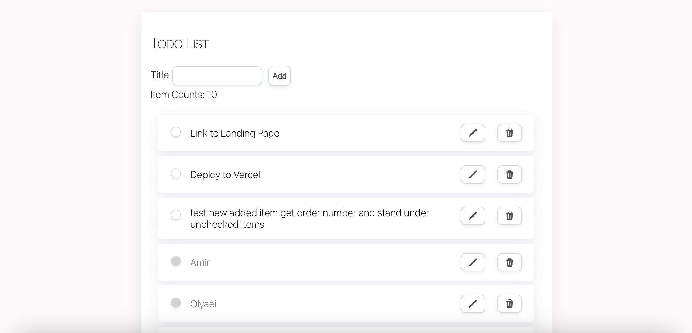

<p align="center">
  <a href="https://tasks-minder.netlify.app/">
    
  </a>
</p>
<h1 align="center" style="color: #b48eed;">
  React App: Task Minder™
</h1>

[](https://github.com/AmirhosseinOlyaei?screen_name=AmirhosseinOlyaei)
[](https://tasks-minder.netlify.app/)
[](https://github.com/AmirhosseinOlyaei/flamingo-react-todo/graphs/contributors)
[](https://github.com/AmirhosseinOlyaei/flamingo-react-todo/network/members)
[](https://github.com/AmirhosseinOlyaei/flamingo-react-todo/stargazers)
[](https://github.com/AmirhosseinOlyaei/flamingo-react-todo/issues)
[](./LICENSE)
[](https://github.com/sponsors/AmirhosseinOlyaei)



## Task Minder: Your Personal To-Do List Assistant

Welcome to **Task Minder**, the ultimate to-do list application designed to streamline your task management and boost your productivity.

Our app is crafted with care to help you stay organized, whether you're juggling personal errands, work assignments, or planning your next big project. With **Task Minder**, managing your daily tasks becomes effortless and intuitive.

## 📋 Table of Contents

- [Key Features](#key-features)
- [Why Choose Task Minder?](#why-choose-task-minder)
- [Getting Started](#getting-started)
- [Prerequisites](#prerequisites)
- [Installation](#installation)
- [Usage](#usage)
- [Additional Resources](#additional-resources)
- [Acknowledgments](#Acknowledgments)
- [Contact](#contact)
- [Author](#author)
- [License](#license)
- [Feedback](#feedback)

## Key Features

- **User Authentication**: Securely sign in and keep your tasks private and accessible across your devices.

- **Task Management:** Create, edit, and delete tasks with ease. Organize them by priority, deadline, or custom categories.

- **API Integration:** Synchronize your tasks across different platforms and devices, ensuring you're always up to date.

- **Responsive UI Design:** Enjoy a seamless experience on any device, thanks to our adaptive and user-friendly interface.

- **Custom Notifications:** Set reminders for your tasks and never miss a deadline again.

## Why Choose Task Minder?

**Simplicity:** Our clean and clutter-free interface makes navigating your to-do list a breeze.

**Efficiency:** With features like drag-and-drop organization and quick edit options, managing your tasks has never been faster.

**Customization:** Tailor your task management experience with customizable themes, task categories, and notification sounds.

<a id="getting-started"></a>

## 🚀 Getting Started

To get a local copy up and running follow these steps.

<a id="prerequisites"></a>

### 📦 Prerequisites

- npm

```sh
npm install npm@latest -g
```

> It updates npm to the latest version.

<a id="installation"></a>

### 📥 Installation

- Clone the repo

```sh
SSH:
git clone git@github.com:AmirhosseinOlyaei/flamingo-react-todo.git

HTTPS:
git clone https://github.com/AmirhosseinOlyaei/flamingo-react-todo.git
```

- Install NPM packages

```sh
npm install
```

<a id="usage"></a>

### 💡 Usage

To run the application, execute the following command:

```sh
npm run dev
```

The application will open in your default web browser at http://localhost:3000. You can add new todo items, mark them as complete, and delete them.

<a id="additional-resources"></a>

## 🎓 Additional Resources

- [React](https://react.dev/)
- [Learn React](https://scrimba.com/learn/learnreact)
- [Markdown](https://www.markdownguide.org/)

## Acknowledgments

Special thanks and a shout out to the following individuals and organizations:

- [Code the Dream](https://www.codethedream.org/) for their exceptional coding school, providing valuable learning resources and support.
- Hat tip to anyone whose code was used.

## Contact

If you have any questions or feedback, feel free to reach out to [DevArts](https://devarts.notion.site/devarts/61c6b79808ce476290c753165851b070?v=9d442848a814451fba7a2e1b99bebb9b).

<a id="author"></a>

## 👨‍💻 Author

- [Amir Olyaei](https://github.com/AmirhosseinOlyaei)

<a id="license"></a>

## 📜 License

Distributed under the MIT License. See [`LICENSE`](./LICENSE) for more information.

## Feedback

Your feedback is invaluable to us! If you have any suggestions or run into issues while using **Task Minder**, please open an issue on our GitHub repository. We're committed to making **Task Minder** the best it can be, and your input helps us achieve that goal.

Thank you for choosing **Task Minder** as your to-do list companion. Let's make task management a seamless and productive part of your daily routine!
